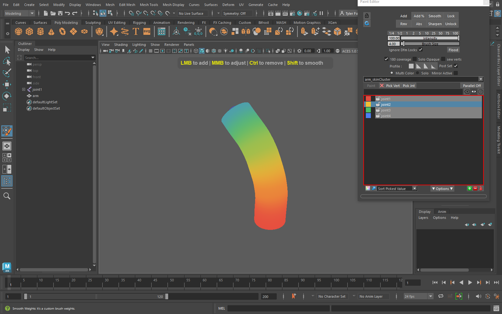
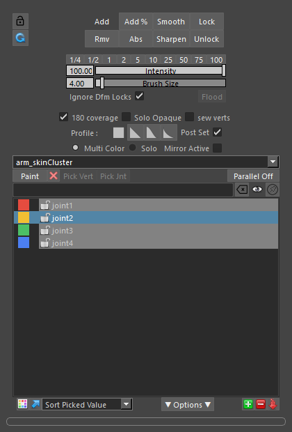
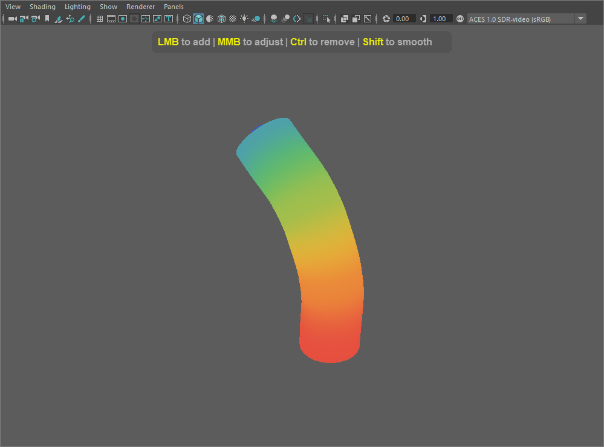
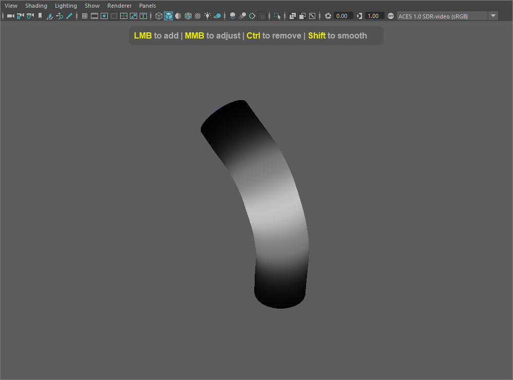
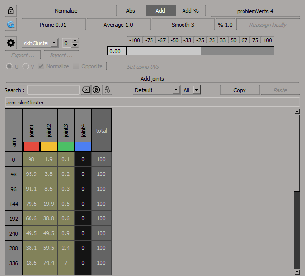

# blurWeightModule

A Maya module with two tools for editing skinCluster weights on meshes and NURBS surfaces:

- **Paint Editor** (`mPaintEditor` + the `brSkinBrush` plugin): a fast skin weight paint brush.
- **Weight Editor** (`mWeightEditor` + the `blurSkin` plugin): a spreadsheet view of the
  weights of the selected vertices, with tools to normalize, prune, smooth and average them.



## Installing

You need Maya 2026 (other versions can be built, see below), Visual Studio 2022, and
`meson` and `ninja` on your `PATH`.

1. Build and install the plugins by running `quick_compile.bat` from the repo root. This
   creates `modules/blurWeightModule.mod`, with the compiled plugins and the Python tools
   inside `modules/blurWeightModule/`.
2. Point Maya at the `modules` folder, either by adding it to `MAYA_MODULE_PATH` or by
   copying `blurWeightModule.mod` (and the `blurWeightModule` folder) into a folder that is
   already on it.
3. The Python tools use [Qt.py](https://github.com/mottosso/Qt.py). If it isn't already
   available in your Maya, install it into mayapy:
   `"C:\Program Files\Autodesk\Maya2026\bin\mayapy.exe" -m pip install --user Qt.py`

The first time the Weight Editor opens, Maya's Safe Mode may ask whether to load
`undoPlug.py`. It is part of this module, so choose **Allow** (and optionally trust the folder).

## Paint Editor

Select a skinned mesh or NURBS surface, then run:

```python
from mPaintEditor import runMPaintEditor
runMPaintEditor()
```



The window lists the influences of the selected skinCluster. To paint:

1. Pick an influence in the list.
2. Pick a mode at the top: **Add**, **Rmv**, **Add %**, **Abs**, **Smooth**, **Sharpen**,
   **Lock** or **Unlock** (the last two lock and unlock vertices).
3. Set the **Intensity** and **Brush Size** (or use the preset buttons above the sliders).
4. Press **Paint** to enter the brush, and paint with the left mouse button in the viewport.

Other controls:

- **Profile**: the falloff of the brush (none, linear, smooth, narrow).
- **Flood**: applies the current mode to the whole mesh.
- **Post Set**: waits until you release the mouse to set the weights, which is faster on
  dense meshes.
- **180 coverage**: also paints vertices facing away from the camera.
- **Ignore Dfm Locks**: paints through locked influences.
- **Mirror Active**: mirrors your strokes across the axis chosen in the options panel.
- **Pick Vert** / **Pick Jnt**: pick the influence to paint from the viewport.
- **Options**: opens extra settings, including solo color range, draw mode,
  smooth repeats, whether Ctrl or Shift smooths, and mirror tolerance.

<br clear="right">

While painting, the mesh shows the weights. **Multi Color** shows every influence in its own
color. **Solo** shows only the current influence, from black (no weight) to white (full weight):

| Multi Color | Solo |
| --- | --- |
|  |  |

The influence colors come from each joint's wireframe color. Use the color swatch in the
influence list to change one.

### Brush hotkeys

These are the defaults. The window's hotkey list always shows the current ones.

| Action | Key |
| --- | --- |
| Paint with the current mode | LMB |
| Remove | Ctrl + LMB |
| Smooth | Shift + LMB |
| Sharpen | Ctrl + Shift + LMB |
| Brush size / strength | MMB drag left-right / up-down (hold Ctrl for fine strength) |
| Marking menu with paint options | U |
| Pick an influence from the joints in the viewport | D |
| Pick the highest weighted influence under the mouse | Alt + D |
| Toggle mirror / solo / solo opaque | Alt + M / Alt + S / Alt + A |
| Toggle the brush wireframe / X-ray joints | Alt + W / Alt + X |
| Set the camera orbit point under the mouse | F |
| Undo the last stroke | Ctrl + Z |
| Exit the brush | Esc |

To swap Ctrl and Shift, so that Ctrl smooths and Shift removes (the XSI layout), choose
**CTRL Smooths** in the options panel.

## Weight Editor

Select a skinned mesh, or some of its vertices, then run:

```python
from mWeightEditor import runMWeightEditor
runMWeightEditor()
```



Each row is a selected vertex and each column is an influence, with the influence color
under its name. The editor follows your selection. The lock button at the top left pins the
current list of vertices, so it stops following the selection.

- **Editing values:** select cells, then type a value or drag the slider. **Abs**, **Add**
  and **Add %** choose how the slider value is applied. The preset buttons above the slider
  set common values.
- **Weight tools:** **Normalize** makes each vertex add up to 100. **Prune** removes weights
  below the threshold. **Smooth** averages each vertex with its neighbors. **Average** gives
  every selected vertex the same weights.
- **Locks:** right-click a column header to lock or unlock influences, or a row header to
  lock or unlock vertices. Edits leave locked weights alone.
- **Filtering:** use the search box to filter influences by name. Wildcards and regular
  expressions both work. You can also hide unused and locked columns.
- **Copy / Paste** copy weights from one set of vertices to another. Each pasted vertex
  takes the weights of the closest copied vertex, using the undeformed mesh.
- **Problem Verts** selects vertices whose edges stretch more than the given factor
  (4 by default) compared to the undeformed mesh. That usually points to bad weights.

## Scripting with blurSkinCmd

The `blurSkin` plugin also provides `blurSkinCmd`, an undoable command for weight operations
from scripts:

```python
from maya import cmds

# Smooth two vertices of a mesh, three times
cmds.blurSkinCmd(command="smooth", meshName="bodyShape", listVerticesIndices=[12, 13], repeat=3)

# Prune small weights on the whole mesh
cmds.blurSkinCmd(command="prune", meshName="bodyShape", threshold=0.01)

# Print the full list of flags
cmds.blurSkinCmd(help=True)
```

The `command` flag can be `smooth`, `add`, `absolute`, `percentage`, `average`, `colors`
or `prune`. If you don't pass `meshName` or `skinCluster`, the command uses the selection,
including soft selection.

## Development

- `src/blurSkin` and `src/brSkinBrush` hold the two C++ plugins, and `scripts/` holds the
  Python tools.
- Building: `quick_compile.bat` builds and installs a debug build for Maya 2026. Edit
  `MAYA_VERSION` and `BUILDTYPE` at the top of it for other versions or a release build.
- Tests: `tests\run_tests.bat` builds the plugins, runs the C++ unit tests, and then runs the
  mayapy integration tests. See [tests/README.md](tests/README.md) for the one-time setup.
- Reloading: `tools/reloadPlugin.py` and the `tools/shelf_blurWeightModule_DEV.mel` shelf
  reload the plugins and tools without restarting Maya.

### Updating the screenshots

The images in `docs/images` are generated. After building, run:

```
tools\capture_screenshots.bat
```

This opens Maya with a temporary preferences folder, so your own prefs aren't touched. It
builds a test scene, opens each tool and saves the screenshots, then quits Maya. The steps
are in `tools/capture_screenshots.py`.
